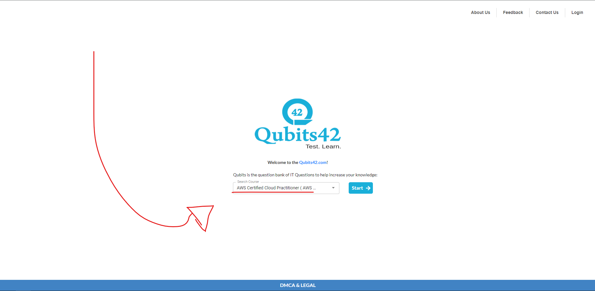

No site abaixo, há uma variedade de exames práticos gratuitos para diversos tipos de certificações.
Com isso, escolha o conteúdo AWS Certified Clour Practitioner para realizar simulados.

Recomendo criar uma conta antes de iniciar os simulados, assim você terá um histórico de erros e acertos
podendo focar nos itens errados e poder estudar os tópicos que foram errados.

[Link para o site QUBITS42](https://www.qubits42.com)